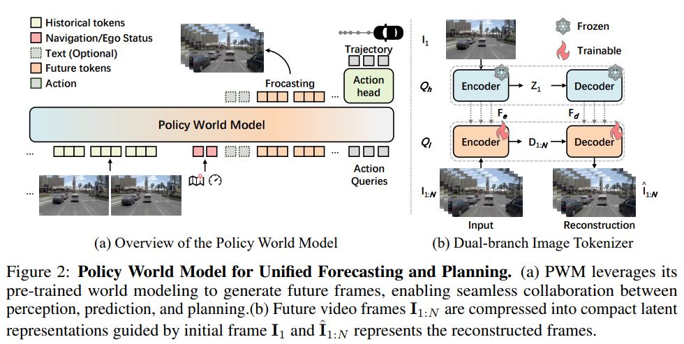
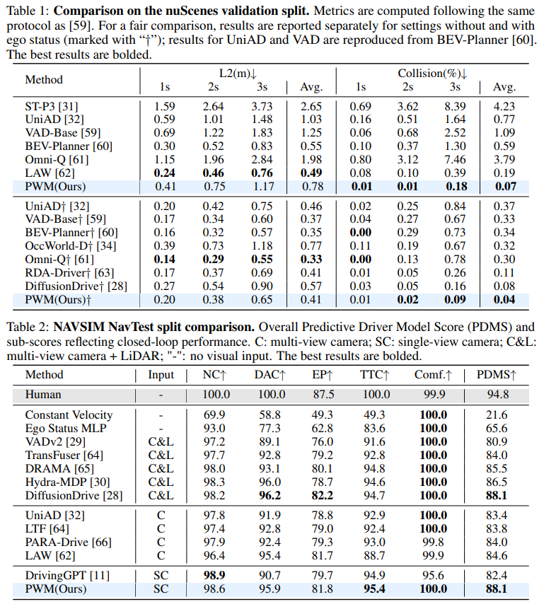

<div align="center">

# **From Forecasting to Planning: Policy World Model for Collaborative State-Action Prediction**

**Zhida Zhao**¹*· **Talas Fu**¹* · **Yifan Wang**¹ · **Lijun Wang**¹† · **Huchuan Lu**¹

¹ Dalian University of Technology

[](https://arxiv.org/abs/2510.19654) [](https://neurips.cc/virtual/2025/poster/115790) [](https://6550zhao.github.io/Policy-World-Model/) [](https://github.com/6550Zhao/Policy-World-Model)

</div>

---

## 📰 News

- **[2025-09-18] 🎉 Our paper has been accepted to NeurIPS 2025 as a poster! 🎉**

---

## 🖼️ Project Overview

<!-- Project Main Figure Placeholder -->
<div align="center">

</div>

---

## 🚀 Key Features

- 🔗 **Unified Framework**: Integrates world modeling and trajectory planning in a single architecture
- 🧠 **Human-like Anticipation**: Mimics anticipatory perception through collaborative state-action prediction  
- ⚡ **Efficient Video Forecasting**: Dynamic parallel token generation with context-guided tokenizer
- 📊 **State-of-the-Art Performance**: Exceeds existing methods on benchmark datasets

---

## 📊 Results

### Performance Comparison

<!-- Replace with your results table image -->
<div align="center">

</div>

---

## 🎯 TODO List

- [x] Release arXiv paper
- [x] Release training and evaluation code
- [x] Release model weights
- [ ] Provide guidelines

---
## Guidlines
This guide provides step-by-step instructions for fine-tuning and evaluating the Policy-World-Model (PWM) on NuScenes and NavSim datasets. Ensure you have completed the environment setup and data preparation before proceeding.
### 1. Clone the Repository
First, clone the repository and navigate to the project root directory:
```
git clone https://github.com/6550Zhao/Policy-World-Model.git
cd Policy-World-Model  # Enter the project folder (replace with your actual path if needed)
```
### 2. Create & Activate Conda Environment
Create and activate the environment with the provided environment.yaml:
```
# Create environment from the configuration file
conda env create -f environment.yaml

# Activate the PWM environment (name: pwm)
conda activate pwm
```
### 3. Data Preparation
#### 3.1 Required Data Files
Download the following resources to run fine-tuning/evaluation:

Pre-trained weights: Download from the official website ([Download](https://huggingface.co/zzzz12334/Policy_World_Model/tree/main)).

Dataset files: Download dataset files from the specified source (for convenience, some required additional dataset files are available for download here: [Download](https://huggingface.co/datasets/talas/pwm_datasets/tree/main)).

#### 3.2 Dataset Directory Structure

Organize your dataset folder as follows (ensure the path matches the configuration in yaml files):
```
dataset/
├── nuscenes/
│   ├── maps/
│   ├── samples/
│   ├── sweeps/
│   └── ominidrive/ # Download from the provided link
└── navsim/
    ├── maps/
    ├── cache/
    ├── navsim_logs/
    ├── sensor_blobs/
    ├── nuplan_img_logs/ # Download from the provided link
    ├── nuplan_scene_blobs/
    │   ├── 10hz_train/
    │   │   ├── 2021.05.12.19.36.12_veh-35_00005_00204/
    │   │   ├── 2021.05.12.19.36.12_veh-35_00215_00405/
    │   │   └── ... (other training scenes)
    │   ├── 10hz_test/
    │   └── 10hz_val/
```
### 4. Evaluation
4.1 Evaluate on NuScenes
Modify the configuration file to enable evaluation mode:
Open configs/sft_nuscenes/nuscenes.yaml
Set experiment.eval_only = True (ensure no extra spaces or syntax errors)
Run the evaluation script:
```
bash scripts/finetune/nuscenes/run_sft_nusc_no_ego_baseline.sh
```
4.2 Evaluate on NavSim
Modify the configuration file to enable evaluation mode:
Open configs/sft_nuscenes/nuscenes.yaml
Set experiment.eval_only = True
Run the evaluation script:
```
bash scripts/finetune/navsim/run_sft_navsim_baseline.sh
```
### 5. Fine-tuning
5.1 Fine-tune on NuScenes
Modify the configuration file to enable training mode:
Open configs/sft_nuscenes/nuscenes.yaml
Set experiment.eval_only = False
Start fine-tuning:
```
bash scripts/finetune/nuscenes/run_sft_nusc_no_ego_baseline.sh
```
5.2 Fine-tune on NavSim
Modify the configuration file to enable training mode:
Open configs/sft_nuscenes/nuscenes.yaml
Set experiment.eval_only = False
Start fine-tuning:
```
bash scripts/finetune/navsim/run_sft_navsim_baseline.sh
```

---
## 🧠 Models
You can download the released model weights from the following link:
---

### 🔹 Stage 1&2
| stage | Model Weights |stage | Model Weights |
|:------:|:-----:|:----:|:------------:|
| **Tokenizer** | [Download](https://huggingface.co/zzzz12334/Policy_World_Model/tree/main/tokenizer) | **Pretrain** | [Download](https://huggingface.co/zzzz12334/Policy_World_Model/tree/main/pre-training) |
---
### 🔹 Stage 3
#### 🔹 nuScenes
| LPIPS↓ | PSNR↑ | FVD↓ | Avg.L2 (m)↓ | Avg.Col (%)↓ | Model Weights |
|:------:|:-----:|:----:|:------------:|:------------:|:-------------:|
| 0.22   | 23.07 | 67.13| 0.78         | 0.07         | [Download](https://huggingface.co/zzzz12334/Policy_World_Model/tree/main/ckpt_sft_nuscenes_wo_ego) |
#### 🔹 NavSim
| LPIPS↓ | PSNR↑ | FVD↓ | NC↑ | DAC↑ | EP↑ | TTC↑ | Comf.↑ | PDMS↑ | Model Weights |
|:------:|:-----:|:----:|:--:|:--:|:--:|:--:|:-----:|:---:|:-------------:|
| 0.23   | 21.57 | 85.95| 98.6 | 95.9 | 81.8 | 95.4 | 100.0 | 88.1 | [Download](https://huggingface.co/zzzz12334/Policy_World_Model/tree/main/ckpt_sft_navsim) |

---
## 🙏 Acknowledgements

We thank the reviewers and the research community for their valuable feedback and support.

---

## 📖 Citation

If you find our work useful, please cite:

```bibtex
@inproceedings{zhao2025pwm,
  title={From Forecasting to Planning: Policy World Model for Collaborative State-Action Prediction},
  author={Zhao, Zhida and Fu, Talas and Wang, Yifan and Wang, Lijun and Lu, Huchuan},
  booktitle={Advances in Neural Information Processing Systems},
  year={2025}
}
```

---

## 📄 License

This project is licensed under the MIT License - see the [LICENSE](LICENSE) file for details.

---

<div align="center">

**🌟 If you find this work helpful, please consider giving us a star! 🌟**

</div>
